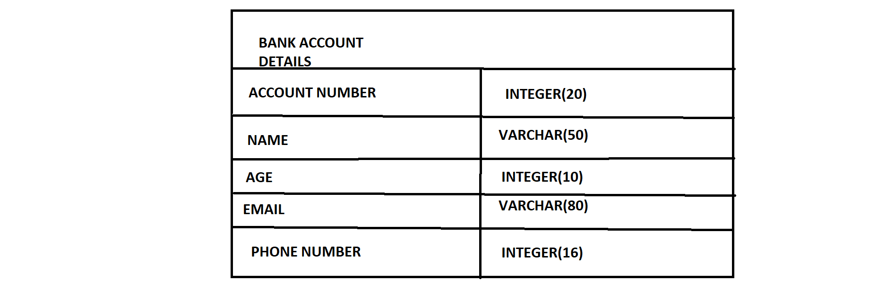
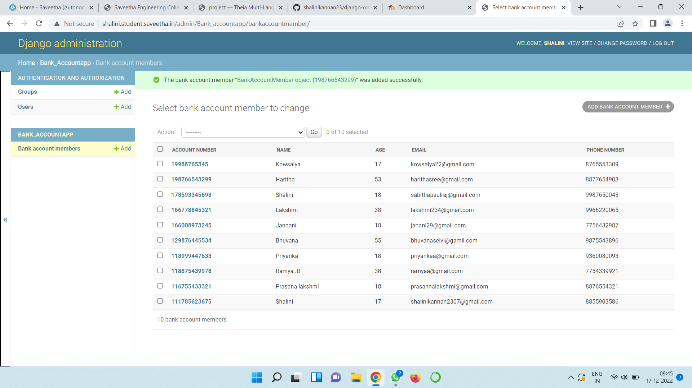

# Django ORM Web Application

## AIM
To develop a Django application to store and retrieve data from a database using Object Relational
Mapping(ORM).


## Entity Relationship Diagram



## DESIGN STEPS

### STEP 1:
Create a new Django project using "django-admin startproject",get into the project terminal and use
"python3 manage.py startapp" command.


### STEP 2:
Define a model for the bank_account  in the models.py.Allow host access and add the app
name under installed apps in settings.py

### STEP 3:
Register the models with the Django admin site. In admin.py under app folder,register the models
with Django admin site.

## PROGRAM
models.py
```
from django.db import models
from django.contrib import admin
#Create your model here.
class BankAccountMember(models.Model):
    account_number = models.CharField(max_length=16,primary_key=True)
    name =models.CharField(max_length=100)
    age = models.IntegerField()
    email = models.EmailField()
    phone_number = models.IntegerField()

class BankAccountAdmin(admin.ModelAdmin):
    list_display = ('account_number','name','age','email','phone_number')
```

admin.py
```
from django.contrib import admin
from .models import BankAccountMember,BankAccountAdmin
# Register your models here.
admin.site.register(BankAccountMember,BankAccountAdmin)
```
## OUTPUT



## RESULT
Successfully developed a Django application to store and retrieve data from a database using Object
Relational Mapping(ORM)